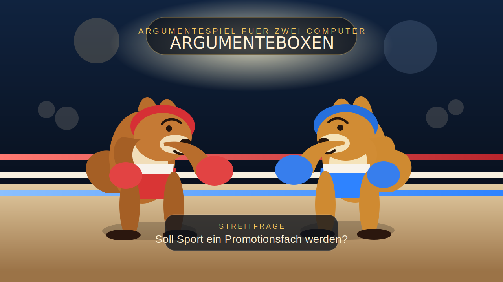

# Argumenteboxen



Ein eigenständiges Zwei-Spieler-Argumentespiel für zwei Computer zur Streitfrage:

**Soll Sport ein Promotionsfach werden?**

Zwei Kängurus treten als `Pro` und `Contra` im Ring gegeneinander an. Ein Angriff besteht aus einem Argument, die Abwehr aus einem Gegenargument. Ist die Abwehr valide, wechselt die Initiative. Ist sie nicht valide, zählt der Schlag als Volltreffer. Wer drei Volltreffer kassiert, geht KO.

## Highlights

- Lokales Multiplayer-Duell für zwei Browser auf zwei verschiedenen Computern
- Klare `Pro`- und `Contra`-Argumentkarten aus der Materialsammlung zum Promotionsfach Sport
- Schnelle Arena-Animationen mit Angriff, Parade, Treffer und KO
- Schaltbare Browser-Sounds für Glocke, Schläge und Volltreffer
- Revanche im selben Raum ohne neues Setup
- Integriertes Logikraster mit Schlussarten und Fehlschluss-Prüfung aus dem Dossier zur Argumentationslehre
- Komplett getrenntes Projekt, nicht mit anderen Workspace-Apps vermischt

## Spielidee

`Pro` eröffnet den ersten Schlagabtausch. Die andere Seite reagiert mit einem Gegenargument:

- Valide Abwehr: kein Treffer, Initiative-Wechsel
- Ungültige Abwehr: Volltreffer
- Drei Volltreffer: KO

Damit wird die Debatte nicht nur gesammelt, sondern als kompetitives Argumenteduell inszeniert.

## Vorschau

- Roter und blauer Känguru-Charakter im Boxring
- Roter und blauer Känguru-Charakter im Boxring
- Live-Kampfprotokoll mit Argumenten und Gegenargumenten
- Trefferanzeige für beide Seiten
- Raumcode-System für die Partie auf zwei Geräten

## Schnellstart

```bash
npm install
npm start
```

Danach im Browser öffnen:

- lokal: `http://localhost:3000`
- zweiter Computer im selben Netzwerk: `http://DEINE-LOKALE-IP:3000`

## So wird gespielt

1. Computer 1 erstellt einen Raum.
2. Computer 2 tritt mit dem angezeigten Raumcode bei.
3. Die Host-Seite startet das Match.
4. `Pro` greift mit einer Argumentkarte an.
5. `Contra` verteidigt mit einer Gegenargumentkarte.
6. Bei valider Abwehr wechselt die Initiative.
7. Bei ungültiger Abwehr gibt es einen Treffer.
8. Nach drei Treffern ist das Match per KO beendet.
9. Die Host-Seite kann direkt eine Revanche starten.

## Inhaltliche Grundlage

Die Argumentkarten wurden aus der Materialsammlung zum Thema
`Sport als Promotionsfach` aufgebaut. Im Zentrum steht die Konfliktfrage:

**Was soll Schule bewerten: ganzheitliche Bildung oder primär kognitive Leistung?**

Zusätzlich bewertet das Spiel jede Abwehr mit einem Logikraster aus dem Dossier
`Argumentationslehre – Gültige und ungültige Formen des Schließens`.
Das Raster prüft:

- These und Prämissen
- direkten Bezug des Gegenarguments
- passende Schlussart
- Tragfähigkeit der Konklusion
- Fehlschluss-Risiko

## Technik

- `Node.js`
- `Express`
- `ws` für Echtzeit-Kommunikation per WebSocket
- Vanilla HTML, CSS und JavaScript
- Integrierte SVG-Figuren statt externer Grafik-Abhängigkeiten

## Plattform

Empfohlen ist `Render`, weil die Plattform laut offizieller Dokumentation Node-Web-Services mit öffentlicher URL bereitstellt und WebSocket-Verbindungen unterstützt.

Für dieses Projekt passt das gut, weil `argumenteboxen` einen laufenden Node-Server mit `Express` und `ws` benötigt und deshalb nicht auf rein statischen Hostern wie GitHub Pages laufen sollte.

### Deploy auf Render

1. Repository auf GitHub öffnen.
2. Bei Render `New > Web Service` wählen.
3. Das Repository `PatrickFischerKSA/argumenteboxen` verbinden.
4. Diese Werte setzen:
   - Build Command: `npm install`
   - Start Command: `npm start`
5. Deploy starten.

Nach dem Deploy ist das Spiel über eine öffentliche `onrender.com`-URL spielbar.

## Projektstruktur

- `server.js`
  Raumlogik, Match-Zustände, Treffer, KO und Revanche
- `src/cards.js`
  Argumentkarten und gültige Gegenargumente
- `src/logic-rubric.js`
  Schlussarten, Fehlschlüsse und Logikbewertung nach dem Dossier
- `public/index.html`
  Spieloberfläche mit Arena, Setup und Kartenbereich
- `public/styles.css`
  visuelles Design, Ring, Kängurus und Bewegungsanimationen
- `public/app.js`
  Client-Rendering, WebSocket-Anbindung, Audio und Bewegungs-Cues
- `assets/preview.svg`
  GitHub-Vorschaubild für das Repository
- `render.yaml`
  Deploy-Konfiguration für Render

## Einsatzidee

Das Projekt eignet sich besonders für:

- Unterrichtseinstiege in Debatten zum Bildungsauftrag
- Wiederholung von `Pro`- und `Contra`-Argumenten
- spielerische Vorbereitung auf mündliche Diskussionen
- motivierende Partnerarbeit mit klarer Rollenverteilung

## Entwicklung

Das Repository ist bereits auf GitHub und kann direkt als eigenständiges Projekt weiterentwickelt oder auf Render deployt werden.
